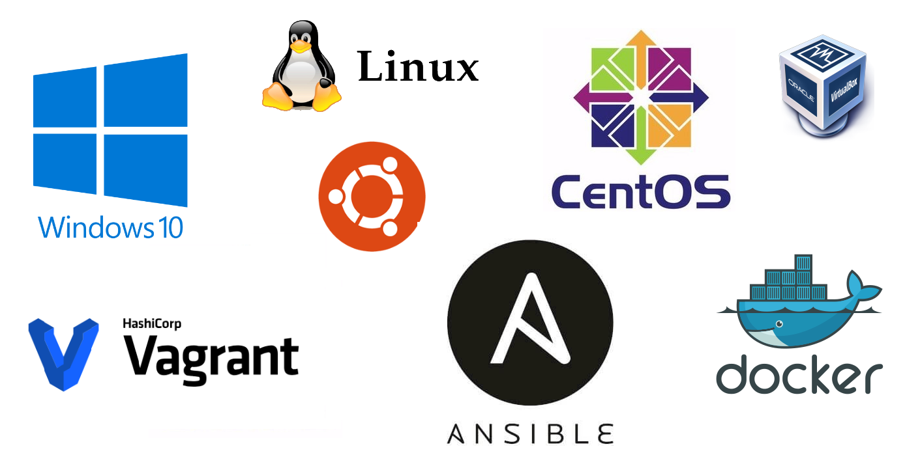

# Better readme gonna be here...

- WSL.sh:  Makes your WSL almost usable :P
- Ansible.sh:  You can even configure your WSL with Ansible :)
- Vagrant.sh:  Run Vagrant from WSL ;)

- choco is comming soon...

# The most-most-most imortant

- environment.sh: is your best friend
- always start your scripts with $PROJECT_ROOT search as shown in sample-script.sh 

